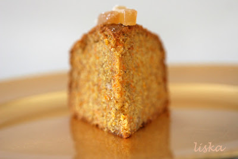

# Ciasto marchewkowe

## Opis

Wilgotne i aromatyczne ciasto marchewkowe z cynamonem. Proste w przygotowaniu, idealne na każdą okazję.

**Porcje:** 12-14  
**Czas przygotowania:** ok. 1 godzina 20 minut  
**Temperatura pieczenia:** 180°C

## Składniki

- 4 jajka
- 250g cukru pudru
- 185ml oleju słonecznikowego
- 300g mąki pszennej
- ¾ łyżeczki soli
- 1 łyżeczka proszku do pieczenia
- 1 łyżeczka sody
- 2 łyżeczki cynamonu
- 400g marchwi (obranej i startej na tarce)

## Sposób przygotowania

1. **Przygotowanie piekarnika i formy:** Piekarnik nagrzać do temperatury 180°C. Okrągłą formę o średnicy 24 cm nasmarować masłem i wysypać mąką.

2. **Masa jajeczna:** Jajka utrzeć z cukrem, następnie dodać olej.

3. **Łączenie składników:** Mąkę, sól, proszek, sodę i cynamon przesiać przez sitko, a następnie połączyć z jajkami. Na końcu dodać tartą marchew.

4. **Pieczenie:** Przelać do formy i piec 1 godzinę.

**Smacznego!**