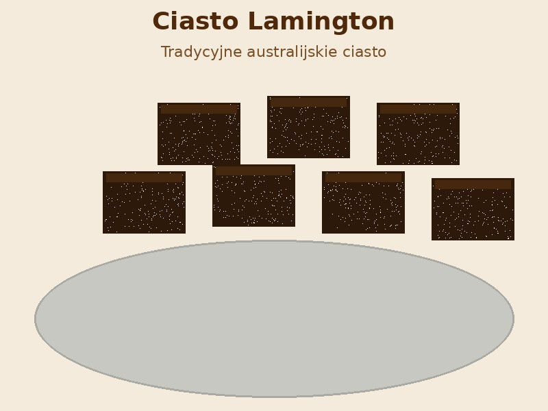

# Ciasto Lamington

## Opis

Klasyczne australijskie ciasto biszkoptowe obtoczone w czekoladowym lukrze i wiórkach kokosowych. Proste w przygotowaniu, idealne na każdą okazję. Lamington to jedno z najbardziej rozpoznawalnych ciast w Australii.

**Porcje:** 24 kawałki  
**Czas przygotowania:** ok. 1 godzina 30 minut (+ schładzanie)  
**Temperatura pieczenia:** 180°C

## Składniki

### Ciasto biszkoptowe

- 2 szklanki mąki pszennej
- 2 łyżeczki proszku do pieczenia
- szczypta soli
- 170 g masła w temperaturze pokojowej
- ¾ szklanki cukru
- 2 jajka w temperaturze pokojowej
- 1 łyżeczka ekstraktu waniliowego
- ½ szklanki mleka pełnotłustego

### Polewa czekoladowa

- 4 szklanki cukru pudru (przesianego)
- ⅓ szklanki kakao (przesianego)
- ½ szklanki ciepłego mleka
- 2 łyżki masła (roztopionego)

### Obtaczanie

- 3–4 szklanki wiórków kokosowych (niesłodzonych)

## Sposób przygotowania

### Ciasto

1. **Przygotowanie piekarnika i formy:** Piekarnik nagrzać do 180°C. Prostokątną formę o wymiarach ok. 20 x 30 cm wyłożyć papierem do pieczenia.

2. **Suche składniki:** Mąkę, proszek do pieczenia i sól przesiać razem do miski.

3. **Masa maślana:** W dużej misce utrzeć masło z cukrem na puszystą, jasną masę. Dodawać jajka po jednym, dokładnie miksując po każdym. Dodać ekstrakt waniliowy i wymieszać.

4. **Łączenie:** Na przemian dodawać do masy maślanej mieszankę mąki i mleko (w dwóch turach), miksując tylko do połączenia składników.

5. **Pieczenie:** Przelać ciasto do przygotowanej formy i równomiernie rozprowadzić. Piec przez 25–35 minut, aż patyczek wbity w środek wychodzi suchy, a ciasto jest złociste.

6. **Schładzanie:** Odstawić ciasto w formie na 5 minut, a następnie wyłożyć na kratkę i całkowicie wystudzić. Dla najlepszych efektów zawinąć w folię spożywczą i wstawić do lodówki lub zamrażarki na 30–60 minut przed krojeniem.

### Krojenie

7. Ostudzone ciasto pokroić na 24 równe kwadraty.

### Polewa czekoladowa

8. W misce wymieszać przesiany cukier puder z kakao. Dodać roztopione masło i ciepłe mleko, mieszając do uzyskania gładkiej, jednolitej polewy.

### Obtaczanie

9. **Przygotowanie stanowiska:** Wiórkach kokosowe wysypać na szeroki talerz. Poniżej kratki umieścić papier do pieczenia, aby zbierać krople polewy.

10. **Obtaczanie:** Przy pomocy dwóch widelców zanurzyć każdy kawałek ciasta w polewie czekoladowej i odczekać chwilę, aż nadmiar spłynie. Następnie natychmiast obtoczyć dokładnie w wiórkach kokosowych ze wszystkich stron.

11. **Suszenie:** Układać gotowe lamington na kratce. Odstawić na ok. 30 minut do stężenia polewy.

**Smacznego!**

---

*Wskazówki:*
- *Schłodzone lub lekko zmrożone ciasto kruszy się znacznie mniej podczas obtaczania.*
- *Lamington przechowuj w szczelnym pojemniku przez kilka dni.*
- *Opcjonalnie: przed obtaczaniem można każdy kwadrat przekroić na pół i przełożyć dżemem malinowym lub truskawkowym i bitą śmietaną.*
