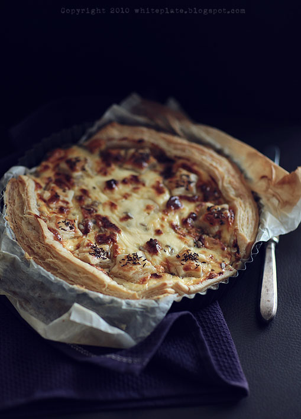

# Tarta z gruszką i serem pleśniowym

## Opis

Elegancka tarta na cieście francuskim z delikatną gruszką i intensywnym serem pleśniowym. 

**Porcje:** 4-6  
**Czas przygotowania:** ok. 50 minut  
**Temperatura pieczenia:** 190°C

## Składniki

### Ciasto i nadzienie
- 1 op. ciasta francuskiego (250-300g)
- 1 duża gruszka
- 120g sera pleśniowego (dowolnego)
- 100ml śmietany
- 1 jajko
- 2 łyżki pestek słonecznika
- 2 łyżeczki kminku (opcjonalnie)

## Sposób przygotowania

1. **Przygotowanie formy:** Ciasto rozwijamy i wkładamy do okrągłej formy. Wylepiamy nim blaszkę, nadmiar obcinamy ostrym nożem i odkładamy na bok.

2. **Masa śmietanowa:** Śmietanę ubijamy z jajkiem w miseczce.

3. **Przygotowanie gruszki:** Gruszkę obieramy, delikatnie wydrążamy gniazdo nasienne i kroimy w cienkie plasterki.

4. **Układanie tarty:** Plasterki gruszki układamy na cieście dookoła brzegu. Następnie wsypujemy pokruszony ser i nasiona słonecznika, na wierzch wlewamy śmietanę z jajkiem.

5. **Dekoracja:** Ze ścinków ciasta wykrawamy foremką dowolne kształty i układamy na tarcie. Smarujemy je odrobiną śmietany z jajkiem i posypujemy kminkiem.

6. **Pieczenie:** Piekarnik nagrzewamy do 190°C. Wstawiamy tartę i pieczemy ok. 35-40 minut.

**Smacznego!**